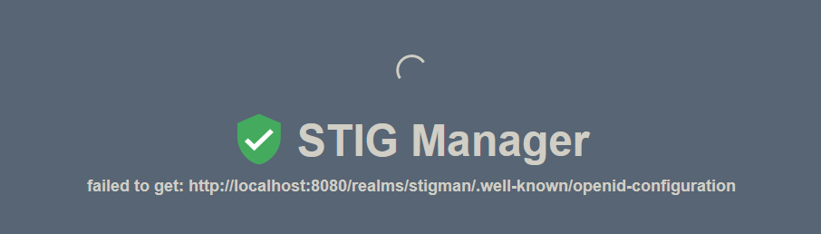
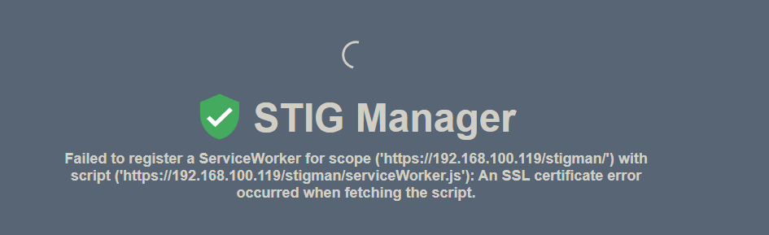

#  Deploy with TLS

## Procedures
* Configure the Reverse Proxy
* Allow Keycloak to Communicate Through the Proxy
* Allow STIG Manager to Communicate with Keycloak
* Fix STIG Manager ServiceWorker.js Error


## Configure the Reverse Proxy
To support HTTPS connections, STIG Manager components should be situated behind a reverse proxy. 
Configure the reverse proxy (such as nginx) in accordance with publisher documentation, 
local security requirements, and Keycloak documentation. In either case, you will have to set
Keycloak environment variable `PROXY_ADDRESS_FORWARDING=true` and make sure appropriate headers are forwarded.


<figure markdown="span">
  { width="450" }
</figure>

## Allow Keycloak to Communicate Through the Proxy.

Execute the below command to edit the keycloak unit file.
```sh
sudo nano /opt/keycloak/conf/keycloak.conf
```

Add the below snippet to the bottom of the configuration file. 
```console
# Custom Configuration
proxy-address-forwarding=true
proxy=edge
```

```console title="keycloak.conf: after changes"
# Basic settings for running in production. Change accordingly before deploying the server.

# Database

# The database vendor.
#db=postgres

# The username of the database user.
#db-username=keycloak

# The password of the database user.
#db-password=password

# The full database JDBC URL. If not provided, a default URL is set based on the selected database vendor.
#db-url=jdbc:postgresql://localhost/keycloak

# Observability

# If the server should expose healthcheck endpoints.
#health-enabled=true

# If the server should expose metrics endpoints.
#metrics-enabled=true

# HTTP

# The file path to a server certificate or certificate chain in PEM format.
#https-certificate-file=${kc.home.dir}conf/server.crt.pem

# The file path to a private key in PEM format.
#https-certificate-key-file=${kc.home.dir}conf/server.key.pem

# The proxy address forwarding mode if the server is behind a reverse proxy.
#proxy=reencrypt

# Do not attach route to cookies and rely on the session affinity capabilities from reverse proxy
#spi-sticky-session-encoder-infinispan-should-attach-route=false

# Hostname for the Keycloak server.
#hostname=myhostname

# Custom Configuration
proxy-address-forwarding=true
proxy=edge
```

Save and exit.

Execute the below command to restart keycloak:
```sh
sudo systemctl restart keycloak.service
```

!!! info
    All should now be ready to access Keycloak from a remote host. 

Access the Keycloak sign-in page.

* Open browser and paste the URL or navigate to [https://{{ server.ipaddress}}](https://{{ server.ipaddress}}) URL.
* Login with the Admin user name and password created earlier.
* All setting and Reals should still be accessible and unchanged.

## Allow STIG Manager to Communicate with Keycloak.

Open browser and paste the url or navigate to [https://{{ server.ipaddress}}/stigman](https://{{ server.ipaddress}}/stigman) URL.

<figure markdown="span">
  { width="500" }
</figure>

!!! info
    STIG Manger will not communicate with keycloak because nginx. 

We need to:

* Change STIG Manager's client OIDC provider to now use `https://`.
* Remove the port `8080`

Execute the below commands to edit STIG Manager's environment file.
```sh
sudo nano /opt/stig-manager/stig-manager.sh
```

```console title="stig-manager.sh: after changes"
...
#==============================================================================
# STIGMAN_CLIENT_OIDC_PROVIDER
#
#  | Default: Value of "STIGMAN_OIDC_PROVIDER" | Client override of the base URL
#  of the OIDC provider issuing signed JWTs for the API.  The string "/.well-
#  known/openid-configuration" will be appended by the client when fetching
#  metadata.
#
#  Affects: Client
#==============================================================================
export STIGMAN_CLIENT_OIDC_PROVIDER=https://{{ server.ipaddress }}/realms/stigman
...
```

Save and exit.

Execute the below commands restart STIG Manager:
```sh
sudo systemctl restart stigman.service
```

Open browser and paste the url or navigate to [https://{{ server.ipaddress}}/stigman](https://{{ server.ipaddress}}/stigman) URL.


##  Fix STIG Manager ServiceWorker.js Error

<figure markdown="span">
  { width="500" }
</figure>


## Summary
!!! success annotate "Summary"
    In these procedures, on a RHEL 7/8 distributions, you have:

    * Configure the Reverse Proxy
    * Allow Keycloak to Communicate Through the Proxy
    * Allow STIG Manager to Communicate with Keycloak
    * Fix STIG Manager ServiceWorker.js Error

## Next Step
[Perform a Reboot](reboot.md)