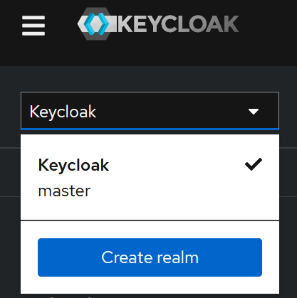
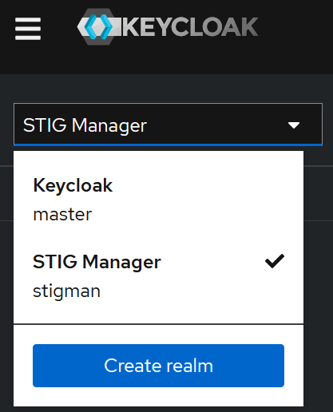

# Installing & Configuring Keycloak

## Procedures
1. [Extract Keycloak Server](#extract-keycloak-server)
2. [Create a Systemd Unit File for Keycloak](#creating-a-systemd-unit-file-for-keycloak)
3. [Create a Symbolic Link (symlink) Folder](#create-a-symbolic-link-symlink-folder)
4. [Enable Keycloak Service on System Startup](#enable-keycloak-service-on-system-startup)
5. [Create the First Administrator From Command Line](#creating-the-first-administrator-from-commandline)
6. [Login and Using the Admin Console](#login-and-using-the-admin-console)
7. [Import STIG Manager Realm Template](#importing-the-stig-manager-realm-template)
8. [Start keycloak As a Service](#start-keycloak-as-a-service)

## Extract Keycloak Server
We are going to install Keycloak to `/opt/` directory, so we will copy/or extract the 
Keycloak package to that location. 


Execute the below commands to move to the `/opt` directory:
```sh
cd /opt/
```

Execute the below commands to unzip the keycloak:
```sh
sudo unzip /opt/deployment/keycloak/keycloak-{{ keycloak.version }}.zip
```

---
## Creating a systemd Unit File for Keycloak
Copy systemd unit file (keycloak.service) under `/opt/deployment/keycloak/scripts/systemd/` to `/etc/systemd/system/` directory.

!!! info
    More information bout system D files can be found here. [systemd Unit Files](https://docs.redhat.com/en/documentation/red_hat_enterprise_linux/9/html/using_systemd_unit_files_to_customize_and_optimize_your_system/assembly_working-with-systemd-unit-files_working-with-systemd#ref_important-service-section-options_assembly_working-with-systemd-unit-files)

Execute the below commands to move to `../systemd/` deployment directory:
```sh
cd /opt/deployment/keycloak/scripts/systemd/
```

Execute the below commands to copy the file:
```sh
sudo cp ./keycloak.service /etc/systemd/system/keycloak.service
```

Below is the content of the `keycloak.service` file
<!-- !!! notice
    We are point keycloak to the conf file in the deployment directory: `/opt/deployment/keycloak/dev/keycloak.conf`. 
    
    We will modify this file once we confirm key cloak is running in dev mode without issues. -->


```sh
[Unit]
Description=The Keycloak Application Server
After=syslog.target network.target
Before=httpd.service

[Service]
Type=simple
WorkingDirectory=/opt/keycloak
Environment="KC_HTTP_ENABLED=true"
Environment="KC_HOSTNAME_STRICT=false"
AmbientCapabilities=CAP_SYS_ADMIN
LimitNOFILE=102642
PIDFile=/var/run/keycloak/keycloak.pid
ExecStart=/bin/bash -c "./bin/kc.sh start"

# Logging
StandardOutput=append:/var/log/keycloak.log
StandardError=append:/var/log/keycloak.log

# Restart
Restart=always
RestartSec=60
TimeoutStartSec=60
TimeoutStopSec=60

SuccessExitStatus=0 143

[Install]
WantedBy=multi-user.target
```

---
## Create a symbolic link (symlink) folder.
A symlink is used hear to make the keycloak folder appear in the same directory on the filesystem but with different names.

!!! info
    This is used to simply version changes without changing the main configuration files. 
    
    For example: the systemd file "`keycloak.service`", will always point to Keycloak rather that a specific version.

Execute the below commands to create the symlink for keycloak:

```sh
sudo ln -s /opt/keycloak-{{ keycloak.version }} /opt/keycloak
```

!!! note
    Below is an example of what this directory would look like for an upgrade. 
    
    To remove the `sudo unlink /opt/keycloak`

    To link `keycloak-{{ keycloak.upgrade }}` run `sudo ln -s /opt/keycloak-{{ keycloak.upgrade }} /opt/keycloak`

Example: 
```sh
...
lrwxrwxrwx. 1 root root   20 Jul  5 20:10 keycloak -> /opt/keycloak-{{ keycloak.upgrade }}
drwxr-xr-x. 8 root root  157 Jul  5 20:09 keycloak-{{ keycloak.version }}
drwxr-xr-x. 8 root root  138 Jul  5 20:29 keycloak-{{ keycloak.upgrade }}
...
```

---
## Enable keycloak service on system startup
Reload systemd manager configuration 
```sh
sudo systemctl daemon-reload
```

Execute the below commands to enable keycloak service on system startup:
```sh
sudo systemctl enable keycloak
```
Output:
```console
Created symlink /etc/systemd/system/multi-user.target.wants/keycloak.service → /etc/systemd/system/keycloak.service.
[root@localhost opt]#
```

---
## Creating the first administrator from command line.
!!! info
    After installing Keycloak, you need an administrator account that can act as a super admin with full 
    permissions to manage Keycloak. With this account, you can log in to the Keycloak Admin Console where 
    you create or import realms and users and register applications that are secured by Keycloak.

If you cannot access the server from a localhost address or just want to start Keycloak from the command line, use the **KEYCLOAK_ADMIN** and **KEYCLOAK_ADMIN_PASSWORD** environment variables to create an initial admin account.

``` bash
export KEYCLOAK_ADMIN=admin
export KEYCLOAK_ADMIN_PASSWORD=Password123!

/opt/keycloak/bin/kc.sh start-dev
```
Output:
```console
UPDATE SUMMARY
Run:                        124
Previously run:               0
Filtered out:                 0
-------------------------------
Total change sets:          124

2024-07-08 20:39:30,834 INFO  [org.keycloak.services] (main) KC-SERVICES0050: Initializing master realm
2024-07-08 20:39:37,301 INFO  [org.keycloak.services] (main) KC-SERVICES0009: Added user 'admin' to realm 'master'
2024-07-08 20:39:37,526 INFO  [io.quarkus] (main) Keycloak 24.0.4 on JVM (powered by Quarkus 3.8.4) started in 26.614s. Listening on: http://0.0.0.0:8080
2024-07-08 20:39:37,527 INFO  [io.quarkus] (main) Profile dev activated.
2024-07-08 20:39:37,527 INFO  [io.quarkus] (main) Installed features: [agroal, cdi, hibernate-orm, jdbc-h2, keycloak, logging-gelf, narayana-jta, reactive-routes, resteasy-reactive, resteasy-reactive-jackson, smallrye-context-propagation, vertx]
2024-07-08 20:39:37,532 WARN  [org.keycloak.quarkus.runtime.KeycloakMain] (main) Running the server in development mode. DO NOT use this configuration in production.
```

!!! info
    From a localhost, open the web browser, go to the [http://localhost:8080](http://localhost:8080) URL.

    From a different computer, open the web browser, go to the [http://eh-stigman-1:8080](http://eh-stigman-1:8080) URL.

## Start Keycloak as a service.
Execute the below commands to exit keycloak.
```sh
ctl + c
```

Execute the below commands to build keycloak:
```sh
sudo /opt/keycloak/bin/kc.sh build
```

Execute the below commands to restart service:
```sh
sudo systemctl restart keycloak.service
```

Execute the below commands to check the status of the service:
```sh
sudo systemctl status keycloak.service
```

Execute the below commands to look at the logs
```sh
tail -f /var/log/keycloak.log
```

---
## Login and using the Admin Console

You configure realms and perform most administrative tasks in the Keycloak Admin Console. Before continuing this step make sure:

> - The Keycloak Server is started and running.
> - You have an administrator account you create in [Step 7](http://127.0.0.1:8000/deployment/keycloak/#step-7-creating-the-first-administrator-from-commandline).

Go to the URL for the Admin Console.

* From localhost, use this URL: [http://localhost/admin](http://localhost:8080/admin)
* From remote host, use this URL: [http://eh-stigman-1:8080/admin](http://eh-stigman-1:8080/admin)

!!! info
    This action should display the Admin Console.

    On the Keycloak Welcome Page, enter the Admin username and password you created in the initial previous guide. 


---
## Importing the STIG Manager Realm Template
A realm in Keycloak is equivalent to a tenant. Each realm allows an administrator to create isolated groups of applications and users. Initially, Keycloak includes a single realm, called master. Use this realm only for managing Keycloak and not for managing any applications.


Use these steps to create the first realm form Admin console.


1. Open the Keycloak Admin Console [http://eh-stigman-1:8080/admin](http://eh-stigman-1:8080/admin).

<figure markdown="span">
  { width="200" }
</figure>

2. Click Keycloak next to master realm, then click Create Realm.

3. You can drag and drop the `import_realm.json` file or press `browse` to to navigate to its location.

4. Click `Create`.

!!! info 
    You should receive a success message notification.

    The new realm should now be available for further configuration.

<figure markdown="span">
  { width="210" }
</figure>


## Summary
!!! success annotate "Summary"

    In these procedures, on a RHEL 7/8 distributions, you have:

    * Installed the JRE requirement for keycloak.
    * Created the Keycloak Server opt directory.
    * Created a user and group for Keycloak.
    * Change permission and ownership of keycloak directory.
    * Created a systemd Unit file for keycloak
    * Created a symbolic link (symlink) folder for keycloak.
    * Enabled keycloak service on system startup.
    * Created the first administrator from command line.
    * Started keycloak as a Service.
    * Log into the Admin Console and import a realm template.